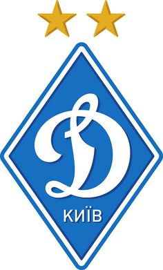

# Fcdk 

FC Dynamo Kyiv unofficial application for fans.

Do not miss Dynamo's next match with `fcdk` gem.

## Installation

  $ gem install fcdk

## Usage

TODO: Write usage instructions here

## Contributing

1. Fork it
1. Run tests.
1. Create your feature branch (`git checkout -b my-new-feature`)
1. Commit your changes (`git commit -am 'Add some feature'`)
1. Push to the branch (`git push origin my-new-feature`)
1. Create a new Pull Request
